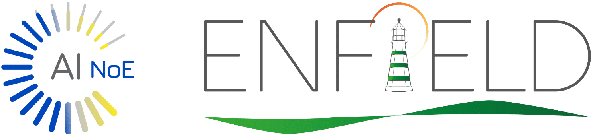

# SeaScope (Earth Observation)
SeaScope is an **Earth Observation workspace** that combines **Google Earth Engine (GEE)**, an interactive map, and an **AI agent** that can write and iteratively improve analysis code.

## Core loop
1. **Sign in with your GEE account**
2. **Ask a question** (what you want to detect/measure/visualize)
3. The **agent generates/edits GEE JavaScript**
4. The code **runs in a browser sandbox**
5. Results are rendered as **map layers**, and you iterate using AOIs + screenshots

## What SeaScope enables
- **Natural-language geospatial analysis** powered by an AI agent
- **Iterative code generation**: agent proposes patches you can review/accept
- **Browser-first execution**: run GEE scripts without a server-side EE runtime
- **Interactive mapping**
  - overlay result layers
  - draw **Areas of Interest (AOIs)** (polygons/rectangles/points)
  - take **screenshots/thumbnails** and use them in the conversation
- **Versioned scripts**: successful runs can be saved as script versions
- **Export operations**: track and poll EE export jobs (when used)

## High-level architecture
SeaScope is built as a 3-panel workspace:
- **Map Panel**: Leaflet map + Earth Engine tile overlays + AOI tools + screenshots/exports UI
- **Editor Panel**: Monaco editor holding the current GEE JavaScript script
- **Chat Panel**: embedded AI chat widget that can:
  - read workspace context (script text, geometries, logs)
  - apply patches to the editor
  - trigger runs

### Execution model (important)
**Earth Engine execution happens client-side**:
- A hidden sandbox iframe runs the GEE JS runtime.
- The user’s GEE OAuth token is stored in the browser and used to:
  - execute the script
  - fetch authorized thumbnails/images/tiles
- The backend does **not** execute GEE code; it persists:
  - **EOScript** (versioned script content)
  - **EOTaskGeometry** (AOIs as JSON)

### Data flow

```mermaid
flowchart TD
  UserBrowser[UserBrowser]
  GoogleOAuth[GoogleOAuth_GEE]
  Workspace[SeaScopeWorkspace]
  MapPanel[MapPanel_Leaflet]
  EditorPanel[EditorPanel_Monaco]
  ChatPanel[ChatPanel_AIWidget]
  Sandbox[GEE_Sandbox_Iframe]
  GEE[GoogleEarthEngine_API]
  Backend[GendoxAPI]
  DB[Postgres_pgvector]
  LLM[LLMProvider]

  UserBrowser -->|OAuth| GoogleOAuth -->|access_token| UserBrowser
  UserBrowser --> Workspace
  Workspace --> MapPanel
  Workspace --> EditorPanel
  Workspace --> ChatPanel
  ChatPanel -->|question| Backend -->|semantic_search| DB
  Backend -->|LLM_call| LLM
  Backend -->|tool_call: patch| EditorPanel
  EditorPanel -->|Run (code + token + geometries)| Sandbox
  Sandbox -->|EE eval + tile requests| GEE
  Sandbox -->|postMessage: layers/logs/exports| MapPanel
  EditorPanel -->|save versions| Backend --> DB
  MapPanel -->|save AOIs| Backend --> DB
```

## Key capabilities (user experience)

### GEE authentication
- **First run**: OAuth sign-in
- **On expiry**: banner prompts reconnect
- Token is stored in **localStorage**

### AOIs (geometries)
- Users draw AOIs on the map
- AOIs are persisted and injected into the runtime as `geometries[]`
- The agent can reference AOIs when writing code

### Screenshots / visual iteration
- Capture map thumbnails/screenshots
- Paste them back into chat to improve the result (thresholds, palettes, clipping, etc.)

## Core components (conceptual)
- **Workspace Grid**: resizable 3-panel layout (Map / Editor / Chat)
- **GEE Auth Guard**: ensures OAuth session is ready
- **GEE Runner**: triggers execution, manages sandbox lifecycle, handles messages
- **Sandbox iframe**: isolated runtime with a strict `postMessage` protocol
- **EO persistence API**: script versions (`EOScript`) + AOI geometries (`EOTaskGeometry`)

## Sandbox message protocol (summary)

### Parent → iframe
- `EXECUTE` (run code with `{ token, geometries }`)
- `GEE_FETCH_OPERATION` (poll export operation)
- `CANCEL_EXPORT`
- `GET_THUMB` (thumbnail/screenshot)

### Iframe → parent
- `IFRAME_READY`
- `SUCCESS`
- `ERROR`
- `PRINT`
- `CENTER`, `ZOOM`
- `CLEAR_LAYERS`, `MAP_OPTIONS`
- `THUMBNAIL`, `SCREENSHOT`
- `EXPORT_STARTED`
- `GEE_OPERATION_RESULT`

## Prerequisites
- A Google Earth Engine account
- A configured OAuth client id for GEE
- A backend API to persist scripts/geometries (or a compatible replacement)

## Configuration
Common environment variables:
- `NEXT_PUBLIC_GEE_CLIENT_ID`: Google OAuth client id for GEE
- `NEXT_PUBLIC_GENDOX_URL`: API base URL
- `NEXT_PUBLIC_MAPS_API_KEY`: optional (depends on map features in your build)

## Local development (example)

### Frontend

```bash
yarn install
yarn dev
```

### Backend (if applicable)

```bash
mvn clean install
mvn spring-boot:run
```

## Repository layout (recommended)
- `frontend/` (SeaScope UI: Map, Editor, Chat)
- `public/gee-sandbox/` (sandbox iframe HTML/JS)
- `backend/` (EO persistence: scripts + geometries)
- `docs/` (user guide + architecture + developer guide)

## Notes and constraints
SeaScope assumes browser-based Earth Engine execution; server-side execution requires a different architecture (service accounts, token brokerage, tile proxying, etc.).

For security and stability, the sandbox iframe should expose only the minimal API and communicate via structured messages.

## Credits
- **Developed by**: Nationl kapodestrean and Ctrl+space Labs
- **Funded by**: Enfield



## License
Add your license here.
