# SeaScope — LLM Evaluation Report
### Retrieval-Augmented Generation vs. Direct Prompting across Remote-Sensing Case Studies

---

## 1. What Is Being Measured

SeaScope is an AI assistant for Earth Observation analysts. It connects Large Language Models (LLMs) to a suite of Google Earth Engine (GEE) tools, enabling users to ask natural-language questions and receive executable geospatial workflows in response.

This evaluation benchmarks **13 LLMs** across **7 real-world remote-sensing case studies**, under two conditions:

| Condition | Description |
|-----------|-------------|
| **With RAG** | The model receives retrieved context from a curated knowledge base of GEE documentation before answering. |
| **Without RAG** | The model is prompted directly, relying solely on its pre-trained knowledge. |

Each model–case-study combination was scored on three dimensions:

- **Evaluation score (0–10):** A holistic quality rating of the generated GEE workflow — correctness, completeness, and adherence to the task requirements.
- **Number of messages:** How many conversation turns were required before a satisfactory result (or failure) was reached. Fewer messages indicate a more autonomous, confident model.
- **Succeed / Failed:** A binary judgment on whether the model ultimately completed the task.

The 7 case studies span diverse EO challenges — ship crash detection from SAR, oil spill mapping, turbidity analysis, ship detection, plastics monitoring, and air quality assessment — representing a realistic breadth of operational tasks.

---

## 2. Data Processing

The raw data lives in a single Excel workbook (`SeaScope - Model Evaluation.xlsx`) with two sheets: **RAG** and **NO RAG**. A Python analysis pipeline (`scripts/analyze_model_evaluation.py`) processes it as follows:

1. **Parsing**: Both sheets are read with `openpyxl`. The `Case study` column uses merged cells (i.e., the name appears only in the first row of each block); these are forward-filled so every row carries its case study label.
2. **Cleaning**: Rows where a model crashed or behaved irrecoverably are marked `×` in the score columns. These are coerced to `NaN` and excluded from mean/std calculations, but kept in message-count tallies.
3. **Normalisation**: Column names are lowercased and stripped of special characters. `rag_status` is derived from the sheet name (`RAG` → `With_RAG`, `NO RAG` → `Without_RAG`).
4. **Validation**: Before any aggregation, raw values, sums, and counts are printed per model per condition to catch accidental averaging bugs. One genuine coincidence was detected: **Claude Haiku 4.5** has an identical mean score (5.71) in both conditions, verified by inspecting its 7 individual values in each group.
5. **Summary statistics**: Mean, median, and standard deviation of evaluation scores; mean message count; and success rate are computed by grouping on `(model, rag_status)` — never collapsing across conditions first.

All figures are saved to `results/` as 150 dpi PNGs. The full per-model summary is in `results/model_summary.csv`.

---

## 3. Findings

### 3.1 — Overview: Quality vs. Efficiency at a Glance

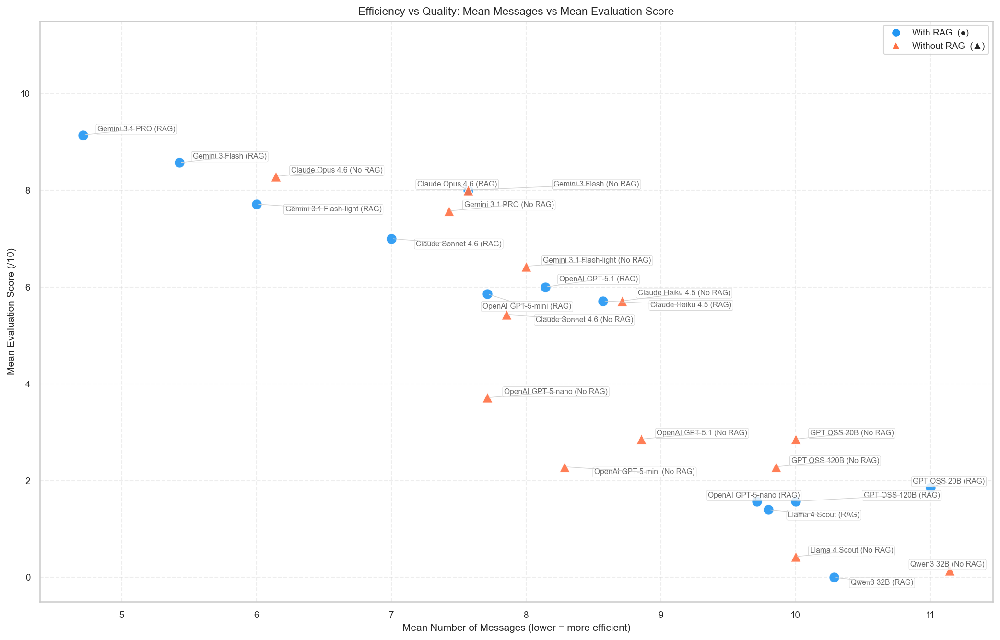

The most useful single frame for understanding the entire dataset is this scatter plot. Each point is one model in one condition. The x-axis is the mean number of messages required to complete a task; the y-axis is the mean evaluation score. The ideal sits in the **top-left corner**: high quality, low effort.

Two patterns are immediately visible:

- A cluster of points in the **upper-left** — high-scoring models that converge quickly. This is where the frontier models with RAG live. **Gemini 3.1 PRO with RAG** is the closest to the ideal corner: 9.1/10 quality in under 5 messages on average.
- A cluster in the **lower-right** — low-scoring models that require many turns regardless. These are the compact and OSS models. They are not just failing; they are failing slowly and expensively.

RAG visibly pulls points upward and to the left for capable models (Gemini family, OpenAI mid-size) but drags points downward and to the right for compact models. That tension is the central finding of this evaluation.

---

### 3.2 — Most Models Improve with RAG, But the Range Is Wide

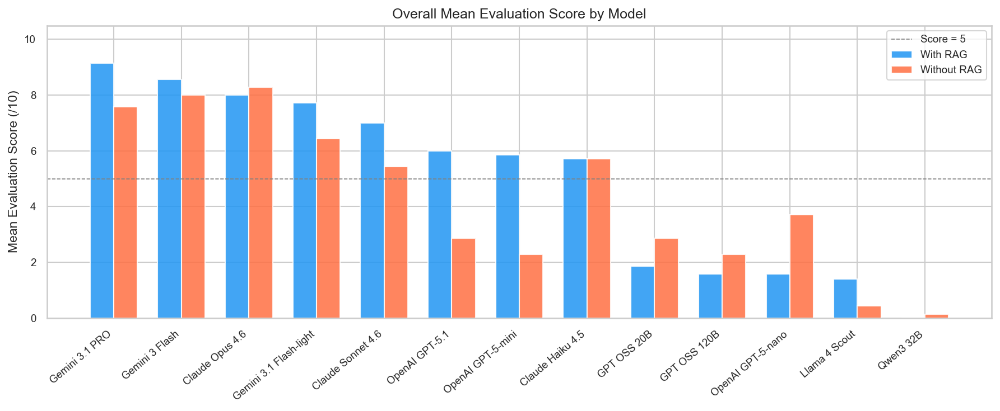

Across all 13 models, **most improve with RAG**, but the magnitude differs by an order of magnitude. The top cluster — Gemini 3.1 PRO, Gemini 3 Flash, Claude Opus 4.6 — already performs at 7.5–8.5 without any retrieval. RAG pushes them closer to 9, a meaningful but modest gain from an already high ceiling.

Below that cluster, the gap between With-RAG and Without-RAG widens sharply. OpenAI GPT-5-mini goes from 2.3 to 5.9. OpenAI GPT-5.1 goes from 2.9 to 6.0. At the other extreme, GPT-5-nano and the OSS models score near zero in both conditions — or worse with RAG than without.

---

### 3.3 — Who Benefits Most? The RAG Impact Ranked

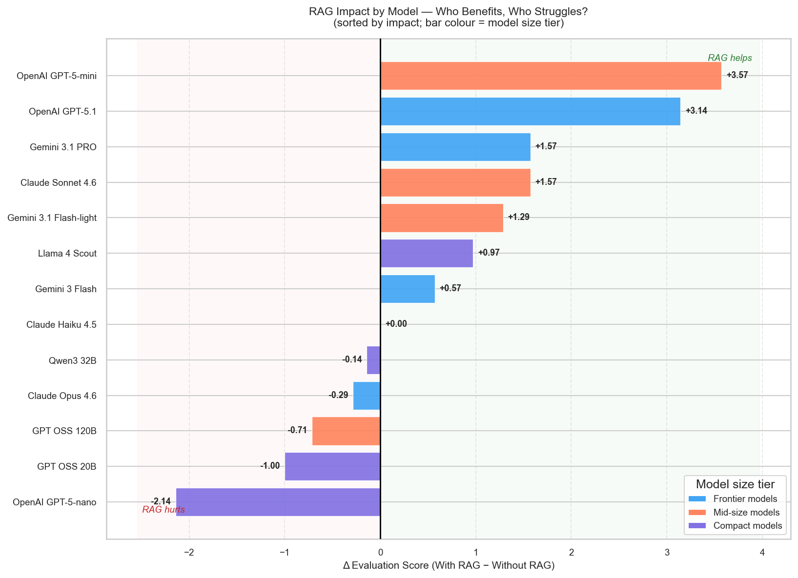

This chart ranks every model by its **RAG delta** — the signed difference in mean evaluation score between conditions. Positive = RAG helps; negative = RAG hurts.

Three tiers emerge:

**Frontier models (teal) gain, but modestly.** Gemini 3.1 PRO and Claude Sonnet 4.6 each improve by +1.57 points. OpenAI GPT-5.1 gains +3.14. These models have strong baseline reasoning and can absorb the retrieved context without being derailed by it.

**Mid-size models (orange) gain the most.** OpenAI GPT-5-mini shows the largest RAG benefit of all: **+3.57 points**. RAG essentially bridges the gap to the frontier tier for a model that otherwise scores only 2.3.

**Compact models (purple) are harmed.** OpenAI GPT-5-nano drops by **−2.14 points**. GPT OSS 20B falls by **−1.00**, GPT OSS 120B by **−0.71**, Qwen3 32B by **−0.14**.

> **Headline finding:** For compact models, RAG does not help — it actively harms performance. When retrieval injects several paragraphs of GEE documentation, these models lose focus on the original task goal. They get distracted by the retrieved text and fail to produce correct, complete code. The most likely mechanism is attention dilution: a prompt that exceeds a compact model's effective instruction-following capacity causes the model to prioritise the retrieved context over the user's actual request.

---

### 3.4 — The Capability–Gain Relationship

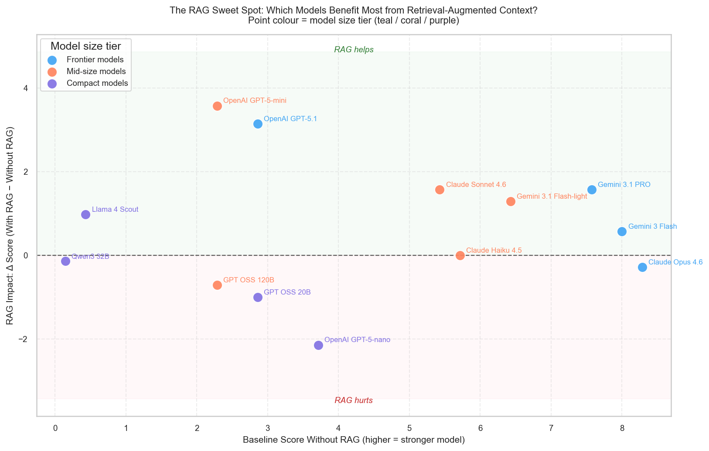

This scatter makes the tier structure explicit as a continuous relationship. The x-axis is the **baseline score without RAG** — the model's raw capability before any retrieval. The y-axis is the **RAG delta**. The green band above the zero line marks positive impact; the red band below marks harm.

- **Frontier models (teal)** sit upper-right: high baseline, modest positive delta. They already know enough to attempt GEE tasks; RAG refines the output.
- **Mid-size models (orange)** cluster upper-middle: modest baseline, largest deltas. Their pre-trained knowledge is incomplete for GEE specifics, but they have sufficient instruction-following capacity to actually *use* the retrieved context.
- **Compact models (purple)** scatter across the lower half. **OpenAI GPT-5-nano** is the sharpest outlier: a baseline of 3.7 (not negligible), yet a −2.14 delta — a model that knows enough to attempt the task unaided, but cannot handle the additional cognitive load of the retrieved context.

---

### 3.5 — Distributions: RAG Stabilises Scores Without Raising the Ceiling

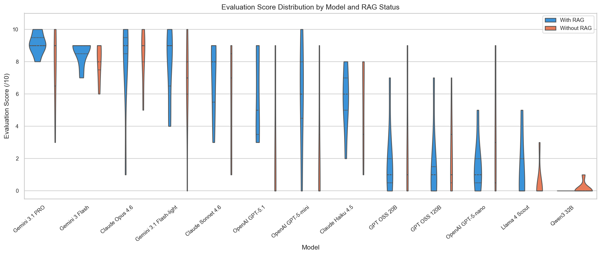

Mean scores conceal within-model variability. The violin / boxplot reveals two effects that the means alone miss:

**RAG reduces volatility for capable models.** Compare the Gemini 3.1 PRO distributions: without RAG the scores spread from 3 to 10 (std = 2.44); with RAG they cluster tightly around 9 (std = 0.69). RAG does not push the ceiling higher — it eliminates the bad runs. The model was already capable of scoring 9–10; retrieval just makes that outcome reliable.

**Claude Haiku 4.5** is the most instructive neutral case: an identical mean of 5.71 in both conditions, but visibly different distributions. Without RAG, scores cluster around 8; with RAG they spread downward, lowering the floor without raising the top. The mean coincidence is real (both groups sum to 40 over 7 distinct values), but the distributions are not the same. RAG does not help Haiku — it introduces inconsistency.

**Compact models** show a pronounced floor effect in both conditions: mass concentrated at or near zero, with the RAG distribution pushing even more weight toward zero than the baseline.

---

### 3.6 — Consistency Across Case Studies

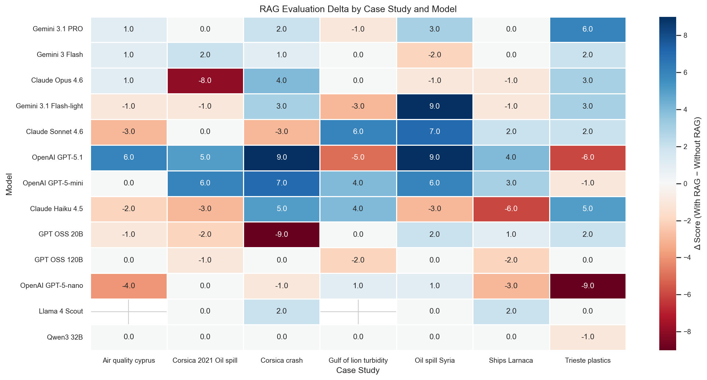

A single mean can be driven by one anomalous scenario. This heatmap breaks the RAG delta down by **case study × model** to check for consistency. Blue cells mark where RAG helped on a specific task; red cells mark where it hurt.

The headline findings hold up under this scrutiny:

- **Gemini 3.1 PRO** is positive or neutral in every single scenario — the most robust model in the study.
- **OpenAI GPT-5-nano's −2.14 mean** is not a single-case outlier: it is negative or flat across the majority of tasks.
- **Compact OSS models** return near-zero scores in almost all cells regardless of condition — they cannot complete these tasks at all.
- Some case studies generate more variance than others, suggesting that task complexity interacts with model capacity in ways that a cross-task mean obscures.

---

### 3.7 — Conversation Efficiency: Fewer Messages, Faster Results

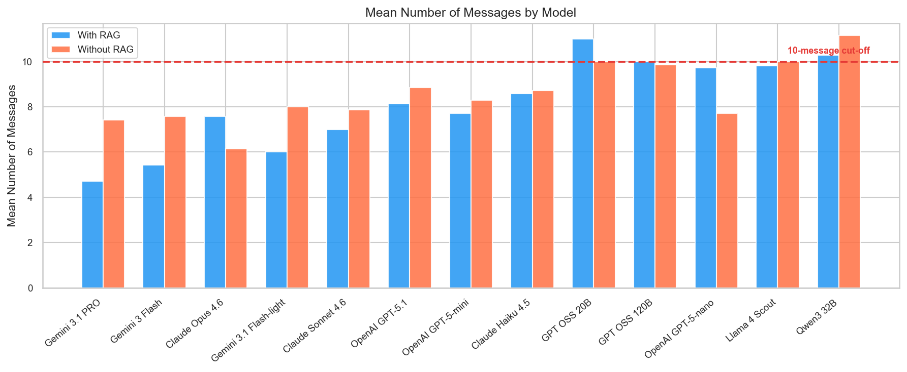

The dashed red line at **10 messages** marks the practical cut-off: a model consistently reaching this limit is not converging — it is being stopped. This is a direct behavioural proxy for failure.

**Gemini 3.1 PRO with RAG averages only 4.7 messages** — the most efficient model in this evaluation. RAG also reduces message counts for the Gemini family broadly (PRO: 7.4 → 4.7; Flash-light: 8.0 → 6.0), consistent with retrieval giving the model the information it needs to answer in fewer turns.

The inverse holds for compact models: **GPT-5-nano's message count increases from 7.7 to 9.7 with RAG**. These models are not benefiting from the retrieved context — they are spending extra turns trying to recover from their own confused initial attempts.

---

### 3.8 — Success Rate: A Binary Summary

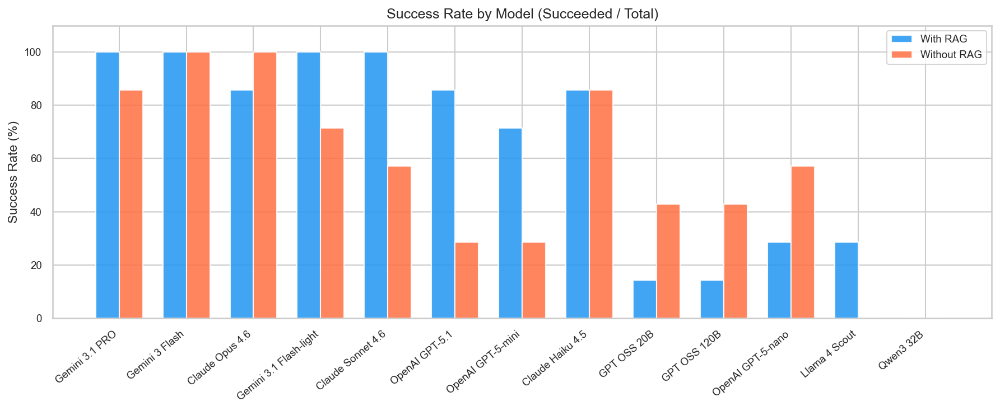

The pass/fail view strips away score nuance and gives the most operationally direct answer. Frontier Gemini models achieve **100% task completion with RAG**. The compact OSS models — GPT OSS 20B, GPT OSS 120B, Qwen3 32B — succeed in only **14% of RAG runs**, down from 43% without RAG. For these models, adding retrieval makes failure the more likely outcome.

---

### 3.9 — Are Rankings Stable Across Tasks?

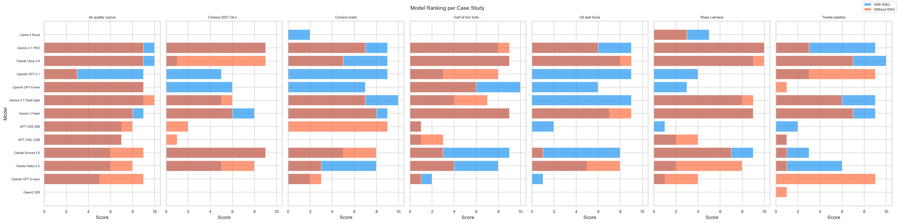

The relative ordering of frontier models is broadly stable across all 7 case studies — they lead in nearly every scenario regardless of domain. The mid-size tier shows considerably more variability: some tasks (those with well-structured GEE APIs and clear output expectations) play to their strengths, while multi-step analyses requiring domain intuition expose their limits more sharply. This suggests that for mid-size models, RAG benefit is not uniform — task structure matters.

---

### 3.10 — The Full Quality Matrix

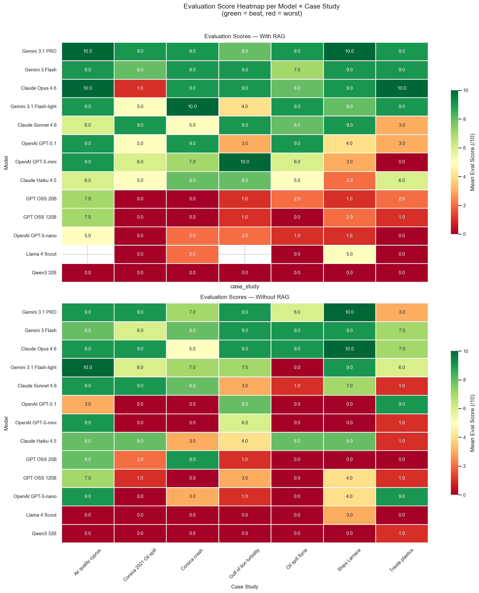

This pair of heatmaps (green = best, red = worst) shows the complete grid of mean scores for every model × case study combination, separately for each condition. It is the most granular view in this evaluation.

Frontier models display broad green fields with RAG, with only isolated red cells (typically the most complex multi-step scenarios). Compact OSS models are nearly entirely red in both panels. The mid-size tier shows the most structured variation: patches of green in scenarios where they succeeded, surrounded by red where they could not — and the With-RAG panel has noticeably more green than the Without-RAG panel for this group.

---

### 3.11 — The Score–Success Relationship

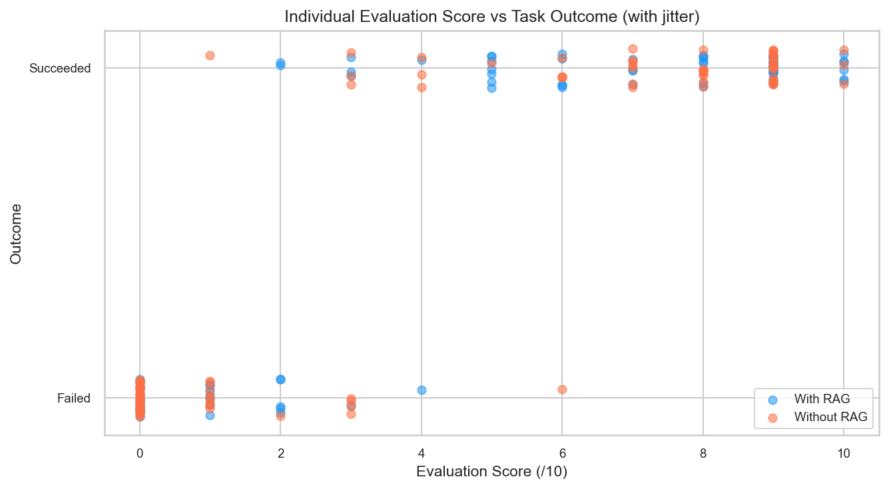

The scatter of individual evaluation scores against the binary succeed/fail outcome confirms that the evaluator's judgment is broadly consistent with the numeric score: succeeded runs concentrate above 5, failed runs below it. A small band of runs scored 4–6 were marked as succeeded — typically partially correct workflows that the evaluator accepted as functional despite imperfections. This boundary effect is consistent across both RAG conditions.

---

## 4. Model-Level Summary

| Model | Mean (With RAG) | Mean (Without RAG) | Δ | Std (With RAG) | Std (Without RAG) | Success (With RAG) | Success (Without RAG) |
|---|---|---|---|---|---|---|---|
| Gemini 3.1 PRO | **9.14** | 7.57 | +1.57 | 0.69 | 2.44 | 100% | 86% |
| Gemini 3 Flash | 8.57 | 8.00 | +0.57 | 0.79 | 1.15 | 100% | 100% |
| Claude Opus 4.6 | 8.00 | 8.29 | −0.29 | 3.16 | 1.70 | 86% | 100% |
| Gemini 3.1 Flash-light | 7.71 | 6.43 | +1.29 | 2.29 | 3.21 | 100% | 71% |
| Claude Sonnet 4.6 | 7.00 | 5.43 | +1.57 | 2.38 | 3.65 | 100% | 57% |
| OpenAI GPT-5.1 | 6.00 | 2.86 | +3.14 | 2.89 | 4.02 | 86% | 29% |
| OpenAI GPT-5-mini | 5.86 | 2.29 | **+3.57** | 3.44 | 3.68 | 71% | 29% |
| Claude Haiku 4.5 | 5.71 | 5.71 | 0.00 | 2.06 | 2.98 | 86% | 86% |
| Llama 4 Scout | 1.40 | 0.43 | +0.97 | 2.19 | 1.13 | 29% | 0% |
| GPT OSS 120B | 1.57 | 2.29 | −0.71 | 2.51 | 2.56 | 14% | 43% |
| GPT OSS 20B | 1.86 | 2.86 | −1.00 | 2.41 | 3.93 | 14% | 43% |
| OpenAI GPT-5-nano | 1.57 | 3.71 | **−2.14** | 1.72 | 3.90 | 29% | 57% |
| Qwen3 32B | 0.00 | 0.14 | −0.14 | 0.00 | 0.38 | 0% | 0% |

---

## 5. Conclusions

**1. RAG is not universally beneficial — it depends on model capacity.**
Retrieval-Augmented Generation helps models capable enough to integrate retrieved context into structured reasoning. For frontier and mid-size models, RAG reliably raises both quality and success rate.

**2. Compact models are harmed by RAG — the leading explanation is context overload.**
For models with limited context-processing capacity (GPT-5-nano, GPT OSS 20B/120B, Qwen3 32B), injecting retrieved GEE documentation does not assist — it distracts. The model loses focus on the user's task goal and produces worse, more confused outputs. This manifests as both lower evaluation scores *and* higher message counts (more failed attempts before the conversation is cut off).

**3. RAG stabilises output quality, not just the mean.**
For capable models, the most important effect of RAG is not raising the average — it is eliminating the bad runs. Gemini 3.1 PRO's standard deviation drops from 2.44 to 0.69 with RAG. For production deployment, this reliability gain may be as valuable as any score improvement.

**4. The mid-size tier delivers the best return on investment.**
OpenAI GPT-5-mini gains 3.57 points from RAG — the largest uplift of any model. For operators who cannot run frontier models at scale, a mid-size model with RAG is a cost-effective alternative that can approach frontier-tier performance on well-structured EO tasks.

**5. Gemini 3.1 PRO with RAG is the current benchmark configuration.**
It achieves the best quality (9.14/10) in the fewest messages (4.7 on average) with 100% task success. It is the reference point for production SeaScope deployment.

**6. Open-source compact models - that can run in consumer hardware - are not yet viable for complex GEE workflows.**
Qwen3 32B scored 0.00 with RAG across all 7 case studies. GPT OSS 20B and 120B succeeded in only 1 of 7 RAG runs. 


---

## 6. Reproducibility

All results can be regenerated from scratch:

```bash
conda activate sea-scope-eval
python evaluations/scripts/analyze_model_evaluation.py \
  --input "evaluations/SeaScope - Model Evaluation.xlsx"
```

Outputs are written to `evaluations/results/`. See `evaluations/scripts/README.md` for setup instructions.

## Credits
- **Developed by**: [Ctrl+Space Labs](https://www.ctrlspace.dev/) and the Laboratory of Environmental Physics–Meteorology of National and Kapodistrian University of Athens
- **Funded by**: [Enfield](https://enfield-project.eu/)  
  The ‘SeaScope: Explainable AI for EO-Driven Maritime Analysis & Monitoring’ action has received funding from the European Union, via oc1-2025-TIS-01 issued and implemented by the ENFIELD project, under the grant agreement No 101120657


