# Urban EO/AI — LLM Evaluation Report
### Agentic AI for Google Earth Engine Workflows in Urban Remote Sensing (Athens Metropolitan Area)

---

## 1. What Is Being Measured

This evaluation benchmarks **5 LLMs** across **12 Earth Observation tasks** for urban geospatial analysis. All tasks target the **Athens metropolitan area** and require generating executable **Google Earth Engine (GEE) JavaScript** workflows from natural-language prompts.

Tasks are organised into four tiers:

| Tier | Theme | Tasks |
|------|-------|-------|
| **A — Fundamental EO** | Dataset queries, cloud masking, NDVI | T1–T3 |
| **B — Aggregation** | Zonal statistics, multi-year composites | T4–T5 |
| **C — Thermal RS** | LST mapping, day–night contrast, anomalies | T6–T8 |
| **D — Urban Heat** | Heat exposure, vulnerability, green cooling, SUHI | T9–T12 |

Each run is scored on two independent rubrics:

| Rubric | Range | What it measures |
|--------|-------|------------------|
| **Rubric A** | 0–10 | Code generation and execution quality (A1–A5: execution success, output validity, dataset/band correctness, GEE patterns, robustness) |
| **Rubric B** | 0–6 | Result interpretation quality (B1–B3: phenomenon identification, spatial patterns, artifacts/uncertainty) |

Label thresholds: Rubric A ≥ 9 = **Strong**, 5–8 = **Partial**, ≤ 4 = **Poor**. Rubric B 6 = **Strong**, 3–5 = **Adequate**, ≤ 2 = **Poor**.

The experimental design includes **RAG ON/OFF** conditions (120 planned runs: 12 tasks × 5 models × 2 modes). At the time of this report, **60 RAG-ON runs** have been scored; RAG-OFF runs are pending.

---

## 2. Data Processing

The raw data lives in `Urban_AI_Evaluation_Workbook.xlsx`. Unlike the SeaScope workbook (separate RAG/NO RAG sheets with a single 0–10 score), the urban workbook uses a structured relational layout:

| Sheet | Role |
|-------|------|
| `Experiment Runs` | **Primary data** — one row per run with rubric sub-scores and totals |
| `Task Suite` | Task definitions, prompts, acceptance criteria |
| `Rubrics` | Scoring criteria reference |
| `Models` | Model metadata |
| `Summary` | Workbook dashboard (formulas) |

The analysis pipeline (`scripts/analyze_model_evaluation.py`) processes the data as follows:

1. **Parsing**: Reads the `Experiment Runs` sheet with `openpyxl`. Blank separator rows are dropped.
2. **Normalisation**: Column names are mapped to canonical names. `RAG Mode` ON/OFF → `With_RAG` / `Without_RAG`.
3. **Success derivation**: A run counts as a full execution success when **A1 = 2** (script executes without manual modification).
4. **Validation**: Raw values, counts, and means are printed per model before aggregation to catch data-entry errors.
5. **Summary statistics**: Mean, median, and standard deviation computed by grouping on `(model, rag_status)` — never collapsing across conditions first.

Outputs are written to `results/` as CSV summaries and 150 dpi PNG figures.

---

## 3. Findings (RAG ON — interim)

> **Note:** These findings reflect the first half of the planned experiment matrix (RAG ON only). RAG comparison charts will be generated automatically once OFF runs are scored.

### 3.1 — Overall Model Performance

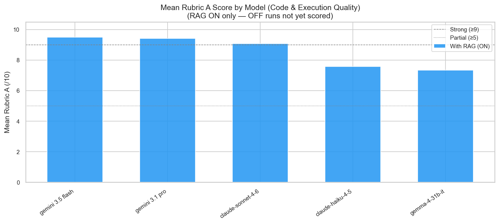

**Gemini 3.5 Flash** leads on code quality (mean Rubric A = **9.50/10**), followed closely by **Gemini 3.1 Pro** (9.42). **Claude Sonnet 4.6** is third (9.08). The open-weight **Gemma 4 31B** and lightweight **Claude Haiku 4.5** trail at 7.33 and 7.58 respectively.

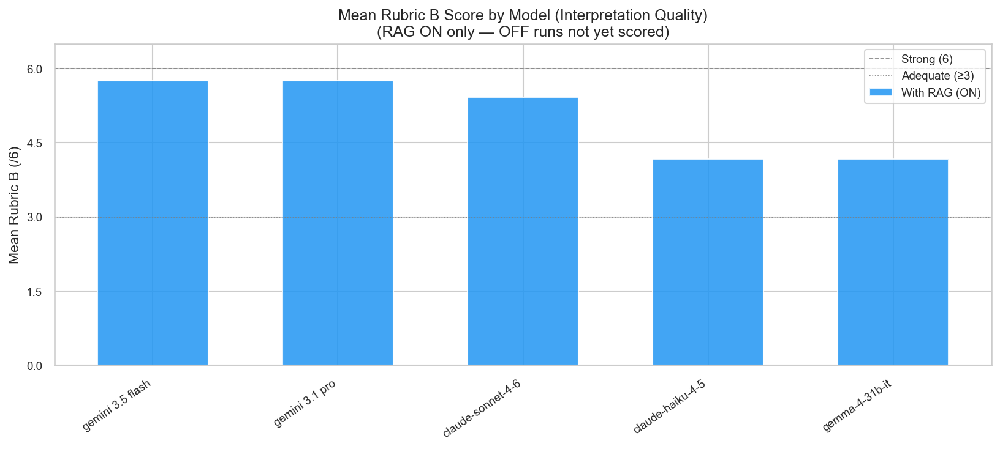

On interpretation quality, the two Gemini models tie at **5.75/6** (Strong). Claude Sonnet follows at 5.42. Haiku and Gemma share the lowest interpretation scores (4.17 — Adequate/Poor boundary).

---

### 3.2 — Code Quality vs Interpretation: A Split Skill

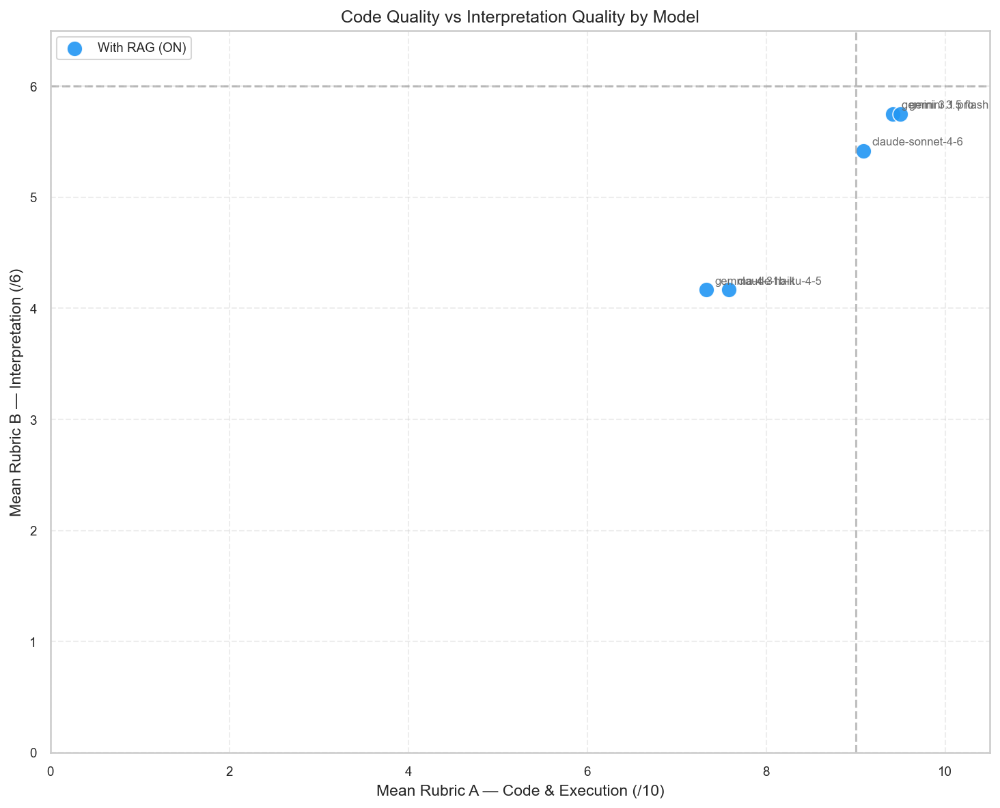

The scatter plot reveals a meaningful gap between **generating correct GEE code** (Rubric A) and **interpreting the results** (Rubric B):

- **Gemini models** sit in the upper-right: strong on both dimensions.
- **Claude Sonnet** produces nearly frontier-level code (9.08) but interpretation lags slightly behind Gemini (5.42 vs 5.75).
- **Gemma and Haiku** cluster lower on both axes, with interpretation particularly weak for Haiku on complex urban-heat tasks.

This suggests that for urban EO deployment, code generation and scientific interpretation may need to be evaluated — and potentially optimised — separately.

---

### 3.3 — Score Distributions

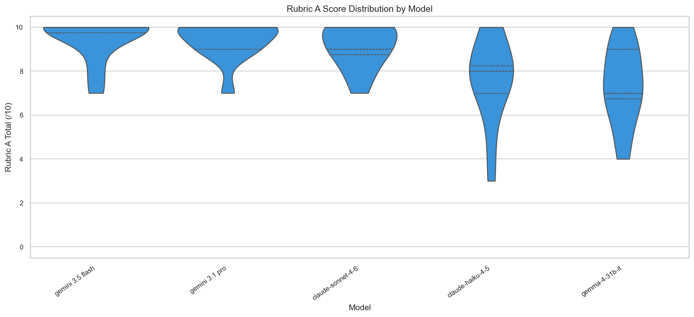

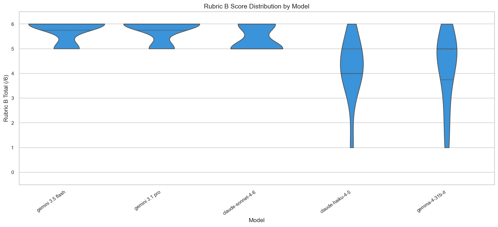

**Gemini 3.1 Pro** shows the tightest Rubric A distribution (std = 0.90), with 11 of 12 runs scoring Strong (≥ 9). **Gemini 3.5 Flash** matches the mean but is slightly more variable (std = 1.00), including one Partial score on T9 (Future heat exposure scenario, 7/10).

**Claude Haiku** has the widest spread on Rubric A (std = 1.98), ranging from 3 (T9) to 10 — indicating inconsistent performance across task complexity tiers.

---

### 3.4 — Task-Level Heatmaps

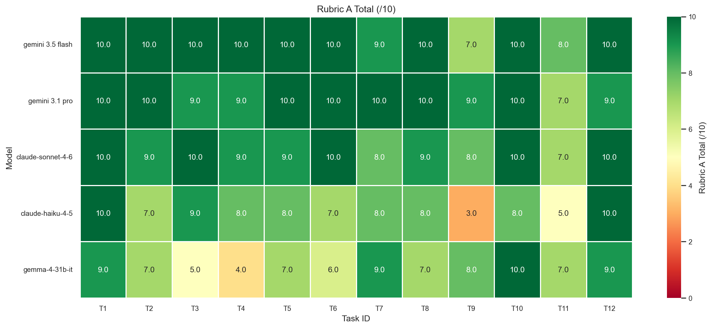

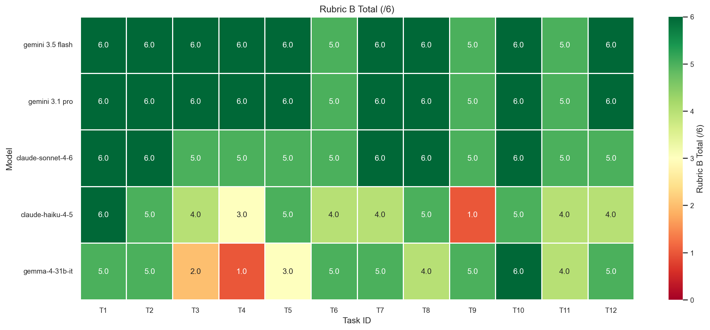

The heatmaps expose which tasks discriminate between models:

- **T9 (Future heat exposure scenario)** is the hardest task overall. Claude Haiku scores 3/10 (Poor) and 1/6 on interpretation; Gemini 3.5 Flash drops to 7/10 on code.
- **T4 (Zonal statistics)** exposes Gemma's limits (4/10) while frontier models score 9–10.
- **Tier D urban-heat tasks (T9–T12)** show more variance than Tier A fundamentals, confirming that applied multi-dataset workflows are the primary differentiator.

---

### 3.5 — Performance by Task Tier

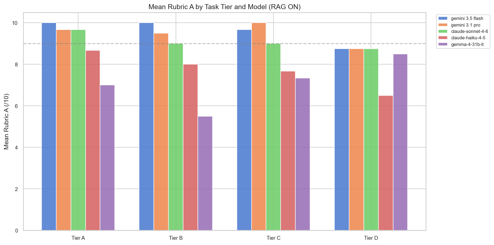

| Tier | Mean Rubric A (all models) | Hardest for |
|------|---------------------------|-------------|
| A — Fundamental EO | 9.00 | Gemma (7.00) |
| B — Aggregation | 8.40 | Gemma (5.50) |
| C — Thermal RS | 8.73 | Haiku (7.67) |
| D — Urban Heat | 8.25 | Haiku (6.50) |

Tier D (urban heat applications) is the most challenging tier on average. Claude Haiku's mean drops to **6.50** on Tier D tasks — well below its Tier A performance (8.67). Gemma struggles most on Tier B aggregation tasks.

---

### 3.6 — Sub-rubric Breakdown: Where Models Lose Points

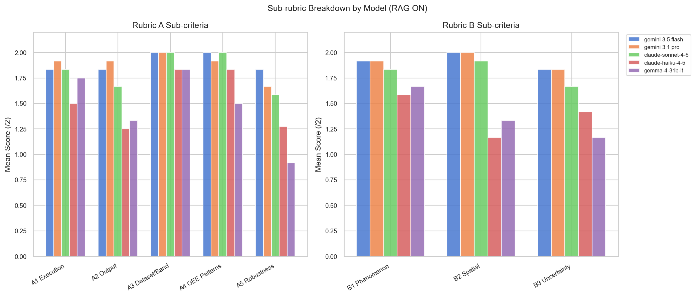

Drilling into individual criteria:

| Criterion | Best model | Weakest model |
|-----------|-----------|---------------|
| A1 Execution Success | Gemini 3.1 Pro (1.92/2) | Claude Haiku (1.50/2) |
| A5 Robustness | Gemini 3.5 Flash (1.83/2) | Gemma 4 31B (0.92/2) |
| B2 Spatial Patterns | Gemini 3.1 Pro (2.00/2) | Gemma (1.33/2) |
| B3 Artifacts/Uncertainty | Gemini 3.1 Pro (1.83/2) | Gemma (1.17/2) |

**Gemma's primary weakness is A5 (Robustness)** — hard-coded values, fragile parameter handling. **Haiku's gap is A1 (Execution)** — scripts often need minor manual correction. **B3 (Uncertainty awareness)** is the most commonly missed interpretation criterion across all non-Gemini models.

---

### 3.7 — Execution Success Rate

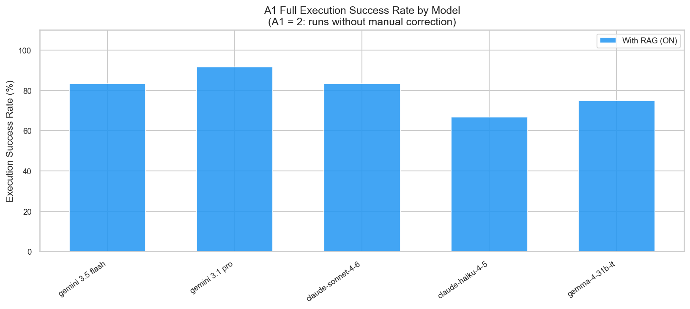

Using A1 = 2 (no manual correction required):

| Model | Full Execution Success |
|-------|----------------------|
| Gemini 3.1 Pro | **91.7%** |
| Gemini 3.5 Flash | 83.3% |
| Claude Sonnet 4.6 | 83.3% |
| Gemma 4 31B | 75.0% |
| Claude Haiku 4.5 | 66.7% |

---

### 3.8 — Per-Task Rankings

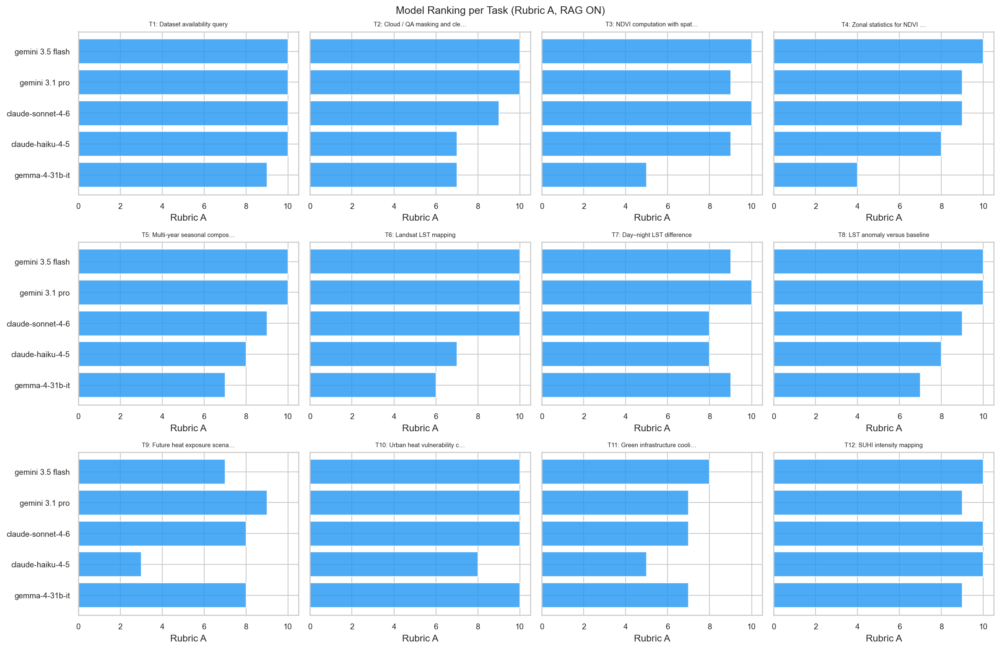

Frontier models (Gemini 3.5 Flash, Gemini 3.1 Pro) lead on nearly every task. The ranking is most stable on Tier A/B tasks and most variable on T9 and T11 (green infrastructure cooling), where Haiku and Gemma fall behind.

Notable qualitative highlights from evaluator notes:

- **Gemini 3.5 Flash on T4**: Correctly identified Acropolis bare rock, National Garden, and Pedion tou Areos from an NDVI zonal map — exceptional spatial interpretation.
- **Gemini 3.5 Flash on T5**: Detected a burned area on Hymettus Mountain from true-colour composites without explicit prompting.
- **Gemma on T2**: Required extra detailed instructions to reduce tool calls before producing a usable script.

---

## 4. Model-Level Summary (RAG ON)

| Model | Mean Rubric A | Mean Rubric B | Strong A Rate | Execution Success |
|-------|--------------|--------------|---------------|-------------------|
| Gemini 3.5 Flash | **9.50** | **5.75** | 83% | 83% |
| Gemini 3.1 Pro | 9.42 | **5.75** | 92% | **92%** |
| Claude Sonnet 4.6 | 9.08 | 5.42 | 75% | 83% |
| Claude Haiku 4.5 | 7.58 | 4.17 | 25% | 67% |
| Gemma 4 31B | 7.33 | 4.17 | 33% | 75% |

---

## 5. Conclusions (interim)

**1. Gemini models lead on both code and interpretation for urban GEE workflows.**
Gemini 3.5 Flash achieves the highest mean Rubric A (9.50); Gemini 3.1 Pro offers the best reliability (91.7% execution success, lowest variance).

**2. Code quality and interpretation are partially independent skills.**
Models can produce Strong code (Rubric A ≥ 9) while scoring only Adequate on interpretation (Rubric B 4–5). This is most visible for Claude Sonnet and Gemma.

**3. Tier D urban-heat tasks are the primary differentiator.**
Fundamental EO tasks (Tier A) are solved by all frontier models. Complex multi-dataset urban heat scenarios (T9–T12) expose weaknesses in compact and open-weight models.

**4. Open-weight Gemma is viable but fragile.**
Gemma 4 31B achieves respectable overall scores (7.33 A / 4.17 B) but loses points on robustness (A5) and requires more steering on tool-heavy tasks.

**5. RAG comparison pending.**
The full 120-run matrix includes RAG OFF baselines. Once scored, re-run the analysis script to produce RAG delta charts and update this report with retrieval-augmented vs direct prompting comparisons.

---

## 6. Reproducibility

All results can be regenerated from scratch:

```bash
python evaluations/urban/scripts/analyze_model_evaluation.py \
  --input evaluations/urban/Urban_AI_Evaluation_Workbook.xlsx
```

Outputs are written to `evaluations/urban/results/`. See `evaluations/urban/scripts/README.md` for setup instructions.

When RAG OFF runs are added to the workbook, the script automatically generates grouped RAG comparison bars and `rag_delta_by_model.png`.
